# Enable Monitoring with Prometheus and Grafana

Install Prometheus and Grafana using the respective Operators available via the Operator Hub. Then create the [resources](resources/) in your namespace.

For more details on how to enable Prometheus Exporter in RHDM see: https://access.redhat.com/documentation/en-us/red_hat_decision_manager/7.8/html/managing_and_monitoring_kie_server/prometheus-monitoring-con_execution-server

Follow below steps to configure the Prometheus and Grafana Operators to enable the monitoring.

### Prerequisites
- Process Server is installed. 
- You have kie-server user role access to Process Server.
- Prometheus operator is installed.
- Grafana operator is installed.

### Assumptions
- All operators installed in same OC Project.
- Set the PROMETHEUS_SERVER_EXT_DISABLED environment variable to false for kie-server.

##### Step 1:
- Create a service account (in my case i used "prometheus" as my service account name and "pammetrics" as namespace)

- YAML file
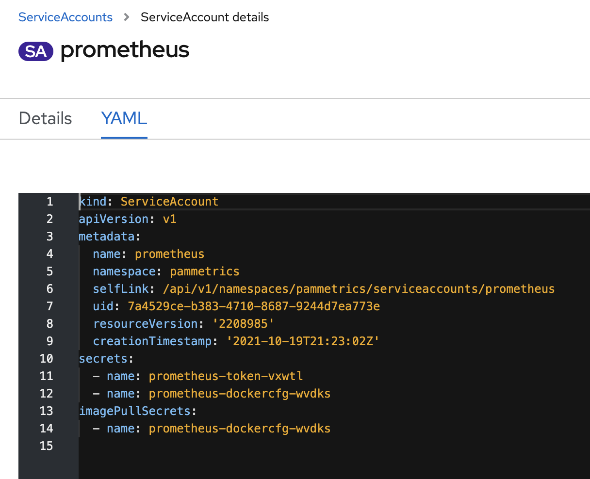

##### Step 2: 
- Create Cluster Role

- Use the [prometheus-cluster-role.yaml](resources/prometheus-cluster-role.yaml) to create a Create Cluster Role.
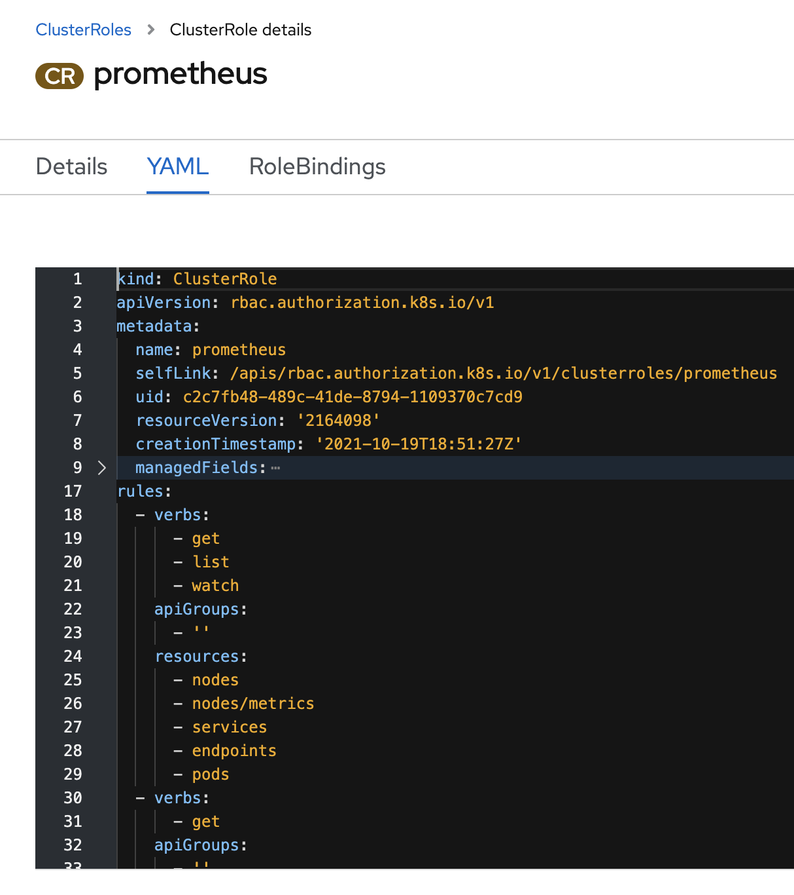

- Create Cluster Role binding

- Use the [prometheus-cluster-role-binding.yaml](resources/prometheus-cluster-role-binding.yaml) to create a Create Cluster Role bindings.
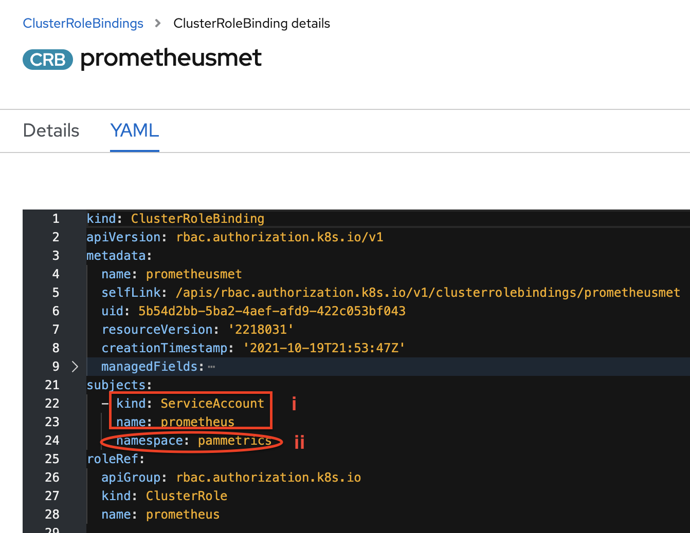

- Validate the cluster role has role bindings after above step
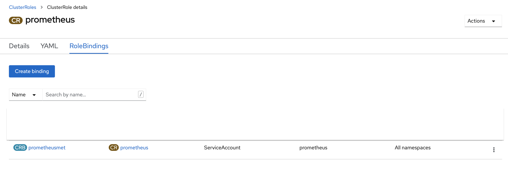

  - Service account which was created in [Step 1](#step-1). Refer (i).
  - NameSpace (in my case "pammetrics" is my project name). Refer (ii).

##### Step 3: 
- Create a running Prometheus instance.
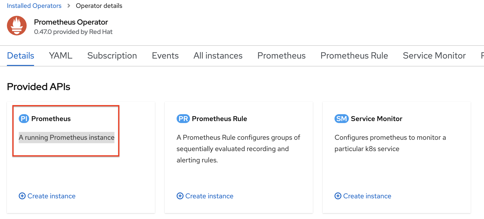
- Use the [prometheus.yaml](resources/prometheus.yaml) to create a Prometheus instance.
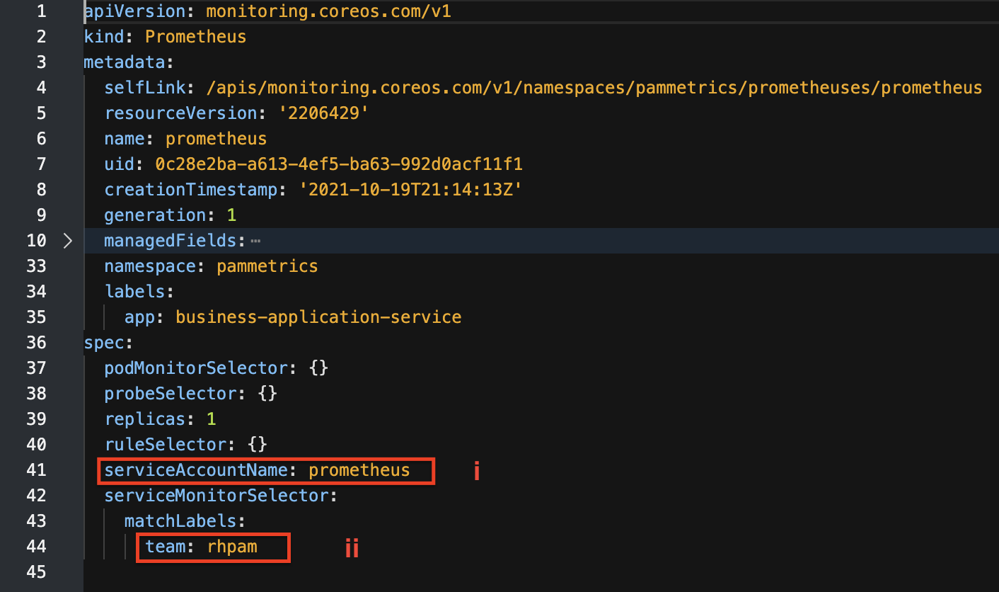

  -  Service account which was created in [Step 1](#step-1). Refer (i).
  -  Label used to match with the ServiceMonitor, refer [Step 6](#step-6). Refer (ii).

##### Step 4: 
- Create a secret with kie-server username and password.

- Use the [metrics-secret.yaml](resources/metrics-secret.yaml) to create a secret.

##### Step 5: 
- Create a Prometheus ServiceMonitor
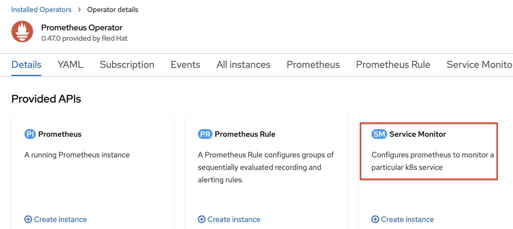

- Use the [service-monitor.yaml](resources/service-monitor.yaml) to create ServiceMonitor. 
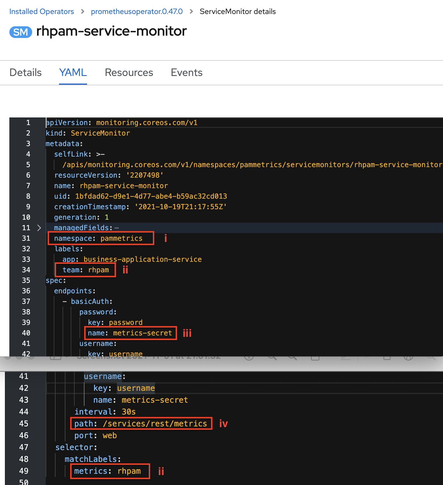

  -  NameSpace (in my case "pammetrics" is my project name). Refer (i).
  -  Label used to match with the Prometheus instance, refer [Step 4](#step-4). Refer (ii).
  -  kie-server secret which was created in Step 5(#step-5). Refer (iii).
  -  Path to access kie-server Prometheus metrics. Refer (iv).

##### Step 6:
- Create a service

- Use the [rhdm-metrics.yaml](resources/rhdm-metrics.yaml) to create Service. 

  -  NameSpace (in my case "pammetrics" is my project name). Refer (i).
  -  Team label used to match with the Prometheus instance, refer [Step 4](#step-4). Refer (ii).
  -  kie-server port, Refer (iii).
  -  kie-server selector config (Refer the kie-server service for selector config details). Refer (iv).

##### Step 7:
- Create a route for Prometheus pod.
- Prometheus pod is StatefulSet so system doesn't create route automatically.

- Use the Prometheus route to check Prometheus expression browser is accisable or not. If we can see metrics here means everything looks good.

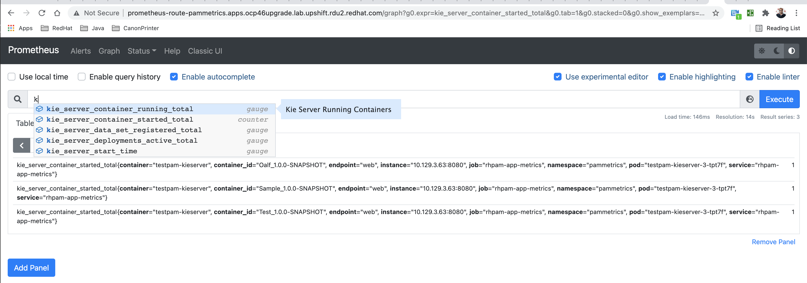

  - Prometheus pod is StatefulSet so delete StatefulSet to take the modified changes into effect.

##### Step 8:
- Create a running Grafana instance.

- Use the [grafana.yaml](resources/grafana.yaml) to create a Grafana instance. 
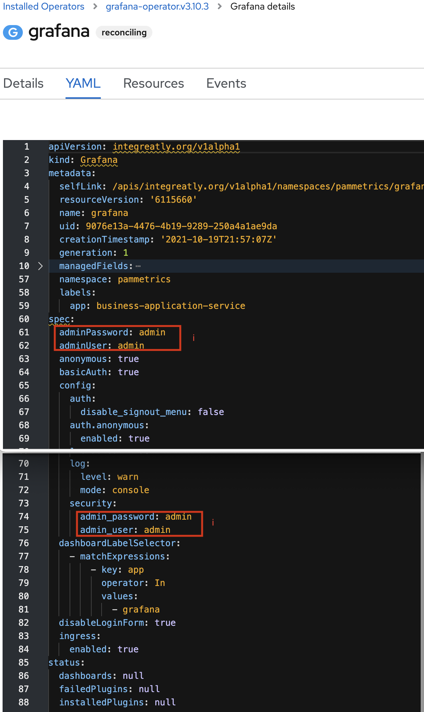
  - Username and passowrd for Grafana. Refer (i).

##### Step 9:
- Create a running Grafana Data Source.

- Use the [grafana-promotheus-ds.yaml](resources/grafana-promotheus-ds.yaml) to create a Grafana Data Source. 
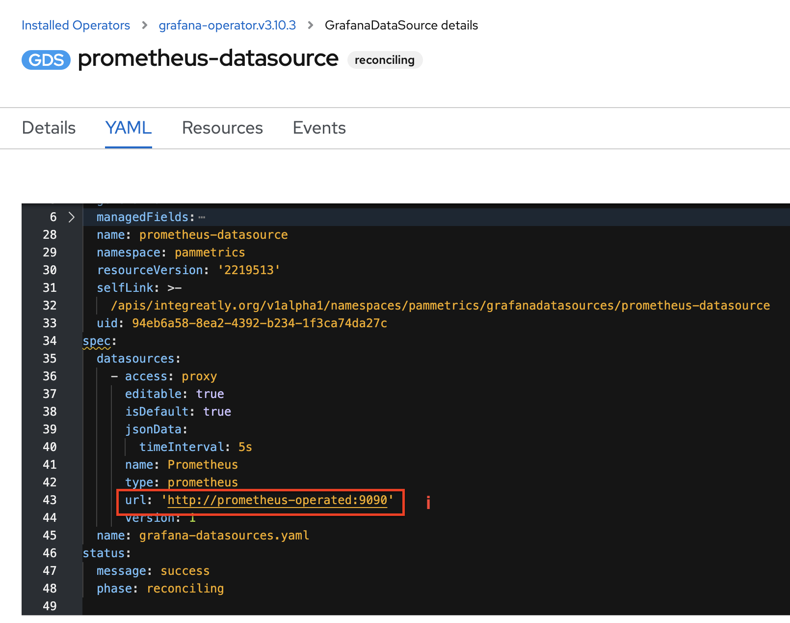
  - Refer Services section
  
- Access the grafana route to login Grafana Dashboard.

### Issues Observed 

##### Issue 1: 
- Failed to pull image "docker.io/grafana/grafana:7.3.10": rpc error: code = Unknown desc = Error reading manifest 7.3.10 in docker.io/grafana/grafana: toomanyrequests: You have reached your pull rate limit. You may increase the limit by authenticating and upgrading: https://www.docker.com/increase-rate-limit
  - Solution
    - It is issue with pull image.
    - Refer solution [here](
https://developers.redhat.com/blog/2021/02/18/how-to-work-around-dockers-new-download-rate-limit-on-red-hat-openshift?ts=1634645587449#docker_s_new_rate_limit).
    - oc secrets link default <pull_secret_name> --for=pull
    - oc secrets link builder <pull_secret_name>

-  > t=2021-10-19T19:31:55+0000 lvl=eror msg="Failed to read plugin provisioning files from directory" logger=provisioning.plugins path=/etc/grafana/provisioning/plugins error="open /etc/grafana/provisioning/plugins: no such file or directory" 
t=2021-10-19T19:31:55+0000 lvl=eror msg="Cant read alert notification provisioning files from directory" logger=provisioning.notifiers path=/etc/grafana/provisioning/notifiers error="open /etc/grafana/provisioning/notifiers: no such file or directory"
t=2021-10-19T19:31:55+0000 lvl=eror msg="cant read dashboard provisioning files from directory" logger=provisioning.dashboard path=/etc/grafana/provisioning/dashboards error="open /etc/grafana/provisioning/dashboards: no such file or directory"
  - Solution
    - [Step 2](#step-2) Solved this issue.
    - Prometheus pod is StatefulSet so delete StatefulSet to take the modified changes into effect.
 